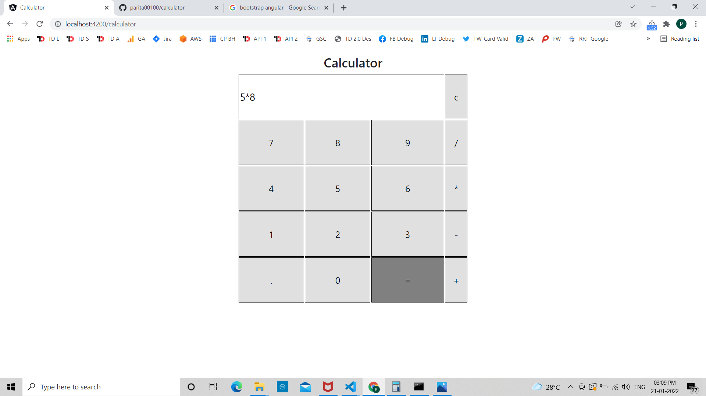

# Calculator

This project was generated with [Angular CLI](https://github.com/angular/angular-cli) version 12.1.1.
## How to run this project

1. Install Dependency:
`npm install`
It will add or install all dependencies that we use in our project. Make sure you have install angular using `npm install -g @angular/cli`
2. Run Project
`npm start`
It will start a project and run on 4200 port. if you want to view on browser, use this link http://localhost:4200
3. Build a project
`ng build`
It will build the project and compile the files which can deploye on production server.

## Project Overview
This project is basically developed for performing operation on numbers.
1. Calculator 

